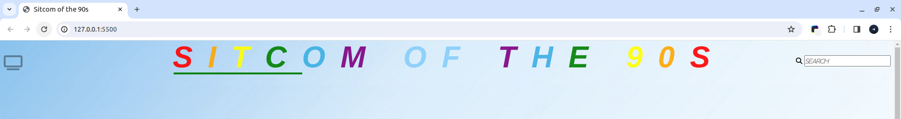
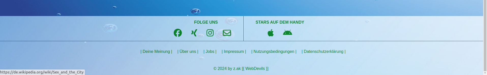
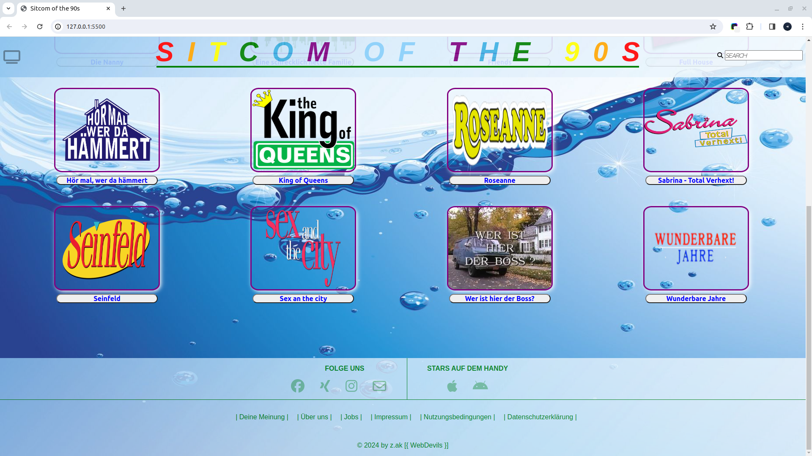

# ~ Die TV-Komödie Galerie ~
 
## Projektbeschreibung:

Die Gallerie enthält eine kleine Sammlung der **Serien** aus der Kategorie **Komödie** der **90er**.
Einige der Serien erschienen in den 80er Jahre und endeten in den 90er. Andere wiederrum starteten in den 90er und erstreckten sich bis zum Anfang des Millenniumswechsels.   

z.B. 
* _Der Prinz von Bel-Air_
* _Eine schrecklich nette Familie_
* _King of Queens_
* _Wer ist hier der Boss?_
* _usw._

## Installationsanleitung:

### Repository klonen:

1. Navigiere auf GitHub.com zur Hauptseite des Repositorys.
2. Verwende den unteren Link:

   `https://github.com/DCI-WD-TZ-23-D01/The-comedy-gallery.git`

3. Klicke oberhalb der Liste auf den grünen Button `"<> Code"`.
4. Zur Auswahl stehen drei bzw. vier Optionen zur Verfügung.
   
   * _HTTPS-LINK_
   
   * _SSH-LINK_

   * _GitHub CLI-LINK_

   * _Download-ZIP_

5. TERMINAL öffnen, ein Zielpfad (Zielort des Ordners) eingeben.
6. Klicke auf den Kopie-Button, um den Link zu kopieren.
7. Gib den Befehl **"git clone"** an und füge den kopierten
   Link hinzu. Rechte Maustaste drücken und auf `"Einfügen"` klicken. Mit `"Enter"` bestätigen, um die Daeien herunterzuladen.

    **!!! WICHTIG !!!**
   
   Die Tastenkombination `"Strg + V"` für den Befehl `"Einfügen"` ist beim Terminal unwirksam!

8. Sind die Daten erfolgreich heruntergeladen, kann **Visual Studio Code** direkt im Terminal 
   mit dem Befehl `"code ."` gestartet werden.
9. Das Reposority kann bearbeitet werden.
    
## Verwendung:

Die Seite enthält eine Kopfzeile (header/nav) sowie eine Fusszeile (footer). Das CSS für den Körper (body/main) ist aufgebaut mit `"grid"` funktion. Über das Beschriftungsfeld, ist ein Schweben (hover) gelegt. Durch klicken des Feldes öffnet sich im selben Fenster die Seite Wikipedia, woraus die Informationen über die Serie bekannt gegeben werden.

## Ressourcen
  > [Normalize CSS](https://cdnjs.cloudflare.com/ajax/libs/normalize/8.0.1/normalize.min.css)
  - _Browser-Standardeinstellung_

  > [Font Awesome](https://fontawesome.com)  
  - _Schriftarten- und Symbol-Toolkit_

  > [Google Fonts](https://fonts.google.com/) 
  - _Schriftarten_

  > [Bilder](https://www.google.com/imghp?hl=de&ogbl) 
  - _Google & Wikipedia Bilder_

  > [Hintergrundbilder](https://www.google.com/imghp?hl=de&ogbl) 
  - _Google Bilder_
  
  > [Lesetext](https://de.wikipedia.org/wiki/Wikipedia:Hauptseite)
  - Wikipedia

## Autor:

Erstellt wurde das Projekt **"TV-Komödie Galerie"** von [Zedan Ak](git@github.com:DCI-WD-TZ-23-D01/The-comedy-gallery.git).

## Lizenz

Das Projekt ist mit der [MIT-Lizenz](LICENSE) lizenziert.

